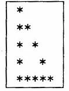

# **ETOX**
## Objective

- Write a method printTriangle that has a char parameter c and an int parameter n. The method should print a triangular pattern with the perimeter consisting of the character c and the interior (if there is one) consisting of blanks. As an example, the call printTriangle('*',5); should produce output of the form

- 

- Write a program asking user to provide a character and an integer, your program should print an open trianglar pattern with blanks in the interior. 

- You may assume that the value of n is positive.

---

- Has In.java
- Used Java version 1.2 ~~(*is updated though*)~~

  

***Made on September 19th, 2023***\
***By: Aaron Prince Anu***

*Temporary?*